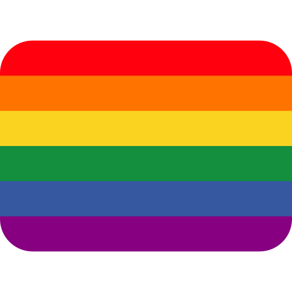

  

# Don't Assume Pronouns
https://dont.assumepronouns.com is *yet* ***another*** minisite, this time focusing on why assuming pronouns is a *big no no*.

## Thoughts?
I'm not good at words, and I'm *certainly* not an "authority" on this topic — if you have suggestions on wording, or any comments at all, please file an issue/pull request 💜

## Development
Content drafting and development is done on the `dev` branch, and then PR'd into `main` when ready.

This repo uses [Prettier](https://prettier.io/) to format the code — it's really opinionated, but it's a great way to keep the code consistent.

Please remember to run `npm run format` before committing, otherwise the CI will cry :-)

## Credits, etc.
 - The rainbow flag is a [twemoji](https://github.com/twitter/twemoji) emoji, so [CC BY 4.0](https://creativecommons.org/licenses/by/4.0), via [Wikimedia Commons](https://commons.wikimedia.org/wiki/File:Twemoji13_1f3f3-fe0f-200d-1f308.svg).